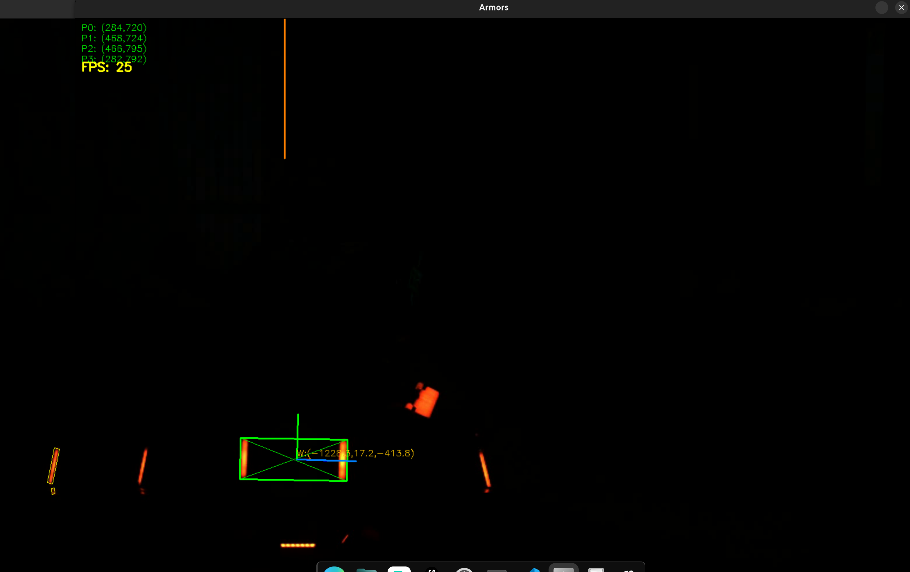
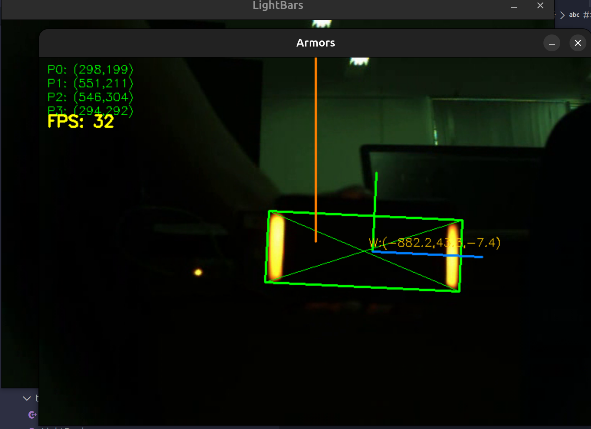

# 华南虎视觉组梯队中期任务

梯队队员姓名：杨思源

## 任务

### 1. 装甲板识别

#### 1.1. 代码思路
根据提供的文档以及网上的相关资料，我将我的代码实现主要分为以下几个步骤：
- 图像二值化预处理，获取红蓝相减得到的边缘。
- 根据面积阈值获取色块位置，匹配形成灯条对象。
- 根据灯条对象的平行度、长度、高低等信息两两配对形成装甲板对象、截取roi。
- 根据装甲板对象角点信息，结合装甲板实际外参以及相机内外参，调用OpenCV内置PnP解算函数，获取装甲板位姿。
- 绘制所需目标图形以及调试用辅助图形。
#### 1.2. 遇到问题
1. 获取色块边缘以寻找灯条的时候先采用的是HSV空间，识别效果不好。
2. 算法将发光噪点也视为灯条。
3. 由于最开始采用HSV空间对色块颜色进行捕捉，导致参数的确认非常繁琐，额外编写了调参程序。
4. 代码量大，在限定时间内难以高质量完成。
#### 1.3. 解决思路
1. 采用BR空间相减的方式捕捉色块位置。
2. 添加面积阈值来筛除噪点
3. 删去HSV相关算法。
4. 运用CodeX辅助编程，为我实现大部分代码逻辑和CMake管理。
#### 1.4. 效果图

#### 1.5. 总结
初步实践了简单的装甲板识别算法，尝试了不同的PnP解算方式，巩固了图像识别基础知识，大致了解了业界最基础的传统识别手段。虽然AI帮了我很多，但是自己从零开始组织一个小项目还是颇有成就感的。
### 2. CMake框架搭建
#### 该项目按要求拉取了Gitee上的两个测试仓库，分别放在本地/CMake_I和/CMake_II目录下，并分别实现。

### CMake_I
#### 实现思路：
经过简单的代码分析可以得知，该项目的结构较为清晰，有一个在头文件中实现**轻量级卡尔曼滤波**的接口库，还有用于实现**装甲板解算的数学函数**实现。上述两个库放在common目录下。紧接着在modules目录下放着四组程序，A1定义了简单的**打印语句**，之后分别在A11到A13三个源程序中进行了实现。A2的头文件定义了一个**双端队列**`__vec`，然后分别声明了其弹出队列元素以及加入队列的函数并在A2的源程序中进行了实现。M1声明了一个简单的类，并声明了其构造函数和析构函数以及成员函数`print`。在源文件中，构造和析构分别答应了一句调试语句，并在成员函数`print`中调用了先前A1中实现的三种打印函数。M2综合了上述所有代码，分别创建了A1和A2类型对象`__a1`和`__a2`，以及四维卡尔曼滤波器指针`__filter`，并在构造函数时对这些变量进行了简单的使用。main函数中使用了M1.h，M2.h和Math.h，分别定义了相关类型的对象并调用了他们的一些简单方法。

从上述分析可以看出整个项目大致的依赖情况，并分析出哪些部分的CMakeLists需要包含哪些库：

首先，由于卡尔曼滤波函数是完全在头文件中实现的，所以我们需要将其添加为接口库，使用`add_library(kalman INTERFACE)`，其次为其寻找并链接上OpenCV库，使用`find_package(OpenCV REQUIRED)`和`target_link_libraries(kalman INTERFACE ${OpenCV_LIBS})`。

然后注意到Math库下并没有CMakeLists文件，于是手动添加并编写。基于上述分析，我们也需要用到OpenCV库并添加静态库文件Math.cpp，于是使用`add_library(math STATIC src/Math.cpp)`。

接下来的部分基本雷同，只不过需要注意依赖关系，尤其是在A1库的实现被分布到三个文件中，所以在添加库的时候需要将三个文件都添加进来。

在处理M1的库文件的时候要注意链接A1，同理在生成M2的时候需要链接A1，A2和卡尔曼滤波器库。

在这里我学到了一点很重要的知识，就是在末尾对M1和M2又打包生成了接口库modules。向AI询问了这么使用的好处我才知道，该方法可以极大抽象内部依赖关系，并暴露单一接口，在后续对以上模组的链接的时候，不必全部了解内部子模块名称，直接调用modules这个接口即可。同时又因为接口库和其他库的链接过程并没有区别，所以又方便后续开发，也方便直接使用。

最后是项目根目录的CMakeLists文件，我们只需要限定最低CMake版本、按照考核README的要求确定项目名称、生成对应名称的可执行文件即可。

#### 一些收获
从这个中期考核我真的学到不少，还是有很多内容不能光看教程，非得真正上手编写、阅读别人的项目代码，才能真正让自己的代码水平得到突破。我一年前绝对想不到代码原来可以分到不同文件中编写，也没有亲眼见过真正复杂的项目代码。直到参加梯队，对编译原理有了初步的认识、接触了越来越大体量的代码项目，才知道维持一个有结构、有条理的项目是多么复杂，也是多么重要。我会尽量保证Task1的视觉识别项目以及机甲杯的视觉项目都按照这个标准要求自己的。

### CMake_II
#### 实现思路：
还是先阅读源码并拆分架构、理清依赖。
经分析，该项目由一些common中的底层模块如数学函数实现和单例模版以及modules中实现的一些函数模组。在阅读源码的过程中，我注意到一些没有学习过的知识，如OPC UA和单例模版等，并简单地进行了一点学习，了解到了这项技术在机器人领域的重要性。

其他的代码架构和CMakeI差别不大，就是运用到了编译选项，在CMakeLists中用if语句对全局变量进行判断来决定到底编译哪些文件。
在初步实现CMake构建之后还是有不少问题，比如cmake_minimum_required中忘记写VERSION了以及个别依赖的连接错误。后续使用VSCode的Codex插件进行了修正，并成功进行符合要求的编译。
#### 一些收获
OPC UA技术给机器人的各部件提供一个公开的实时信息交换平台，在保证高效性的基础上，提供了简洁的共用接口，方便内部同架构模块的访问以及外部异构平台的访问。
### 3. OpenVINO网络部署
#### 实现过程
1. 由于担心自己是AMD平台无法部署这个项目，所以开始知识单纯的学习理论知识。
2. 后来了解到可以正常下载并安装，于是动手尝试安装。
3. 根据提供的教程以及官方文档逐步安装OpenVINO。
4. 克隆深圳大学项目，进行本地部署。
5. 在AI辅助下生成了可以调用OpenVINO进行识别装甲板的测试程序。
6. 调整阈值参数得到较好的识别效果。
## 总结
本次中期考核从整体上检验了上学期的基础知识如CMake的运用、C++的解耦、OpenCV的基础处理以及物体位姿相关知识。在实践过程中确实感受到了视觉算法开发的魅力，大致了解了一个简单的开发工作流，对之后的工作有了大致的概念。同时我也意识到，视觉算法开发并不是简单的一方面的知识，而是一项综合性很高的专业，在实际的开发过程中涉及到各方面的知识，如通信原理、机器人学等，而我离能够完整参与机器人视觉开发还有很长的一段路要走。
但是不管怎么说，现在的这些基础知识都是很必要的，我也应当在项目中去实践、巩固自己的基础知识，为之后的学习铺好路。
我希望自己中期考核的作品能够比较好的反映我上个学期的学习成果，能让组长放心交给我后续的学习任务。
当然，本学期的校内学习也没有拉下，在绝大多数科目满绩的情况下C++拿到了91分、线性代数拿到了93分、学术英语拿到了95分全班第一的好成绩，这无疑奠对我后续的学习定了很好的基础。